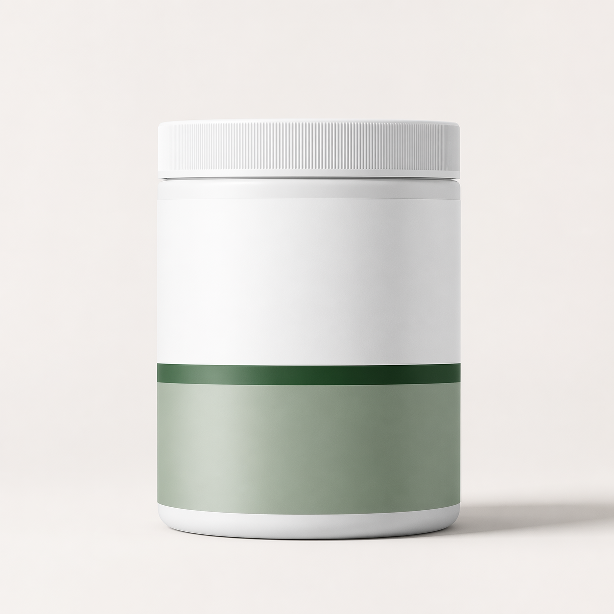

# Awesome GPT-Image-2 E-Commerce Prompts

English | [简体中文](./README.zh-CN.md)

[](./LICENSE)
[](./CONTRIBUTING.md)
[](./prompts)
[](./prompts)

A professional, open-source prompt library for **GPT-Image-2** focused on **e-commerce growth**, **product storytelling**, and **conversion-driven visual production**.

Most GPT-Image-2 repositories are broad galleries of cool experiments. This project is different: it is built as a practical prompt system for brands, growth teams, designers, and AI builders who need images that can actually ship.

## Why This Repo Exists

The current landscape on GitHub is crowded with general-purpose collections of GPT-Image-2 prompts, but still lacks a strong category-first repository for:

- product hero shots
- marketplace packshots
- fashion-on-model campaigns
- beauty and skincare ads
- food and beverage launches
- seasonal commerce banners
- comparison creatives
- PDP and A+ content layouts

This repo fills that gap with prompts designed for **commercial use cases**, not just aesthetic demos.

## What Makes It Different

- E-commerce specific: built around real catalog, campaign, ad, PDP, and social commerce workflows
- Structured prompts: every prompt includes use case, asset type, composition, lighting, constraints, and output notes
- Reusable system: prompts are written as templates teams can adapt quickly
- Curated examples: each flagship prompt comes with a sample generated image
- Open and extensible: designed for contributors from brand, design, and prompt engineering communities

## Research Snapshot

As of **April 23, 2026**, the strongest public GPT-Image-2 prompt repos we found on GitHub are mostly broad inspiration libraries:

- [ZeroLu/awesome-gpt-image](https://github.com/ZeroLu/awesome-gpt-image) collects community prompt examples across photorealism, games, UI, typography, and editing.
- [EvoLinkAI/awesome-gpt-image-2-prompts](https://github.com/EvoLinkAI/awesome-gpt-image-2-prompts) organizes a fast-growing set of portraits, posters, UI mockups, and community showcases.

Opportunity: there is still no clear, professionally packaged, star-worthy open repository dedicated to **e-commerce prompts for GPT-Image-2** with a usable information architecture and commercial prompt patterns.

## Repository Structure

```text
assets/
  examples/               Sample images generated from prompts in this repo
data/
  prompts.json            Structured prompt metadata for tooling and search
prompts/
  beauty/
  fashion/
  food-beverage/
  home-living/
  jewelry/
  seasonal-campaigns/
```

## Prompt Design Standard

Every prompt in this repo follows a simple production-friendly structure:

1. Use case
2. Asset type
3. Primary request
4. Scene and backdrop
5. Subject and styling
6. Composition and framing
7. Lighting and mood
8. Text constraints
9. Commercial constraints
10. Adaptation tips

## Featured Prompts

### 1. Luxury Skincare Hero

File: [prompts/beauty/luxury-skincare-hero.md](./prompts/beauty/luxury-skincare-hero.md)

Designed for premium serum launches, landing pages, paid ads, and high-end PDP banners.


### 2. Clean Supplement Packshot

File: [prompts/food-beverage/clean-supplement-packshot.md](./prompts/food-beverage/clean-supplement-packshot.md)

Built for wellness brands that need science-clean, modern marketplace imagery with strong shelf clarity.


### 3. Luxury Jewelry Campaign Visual

File: [prompts/jewelry/luxury-jewelry-campaign.md](./prompts/jewelry/luxury-jewelry-campaign.md)

Optimized for premium social ads, homepage hero sections, and editorial launch assets.



### 4. Summer Beverage Launch Banner

File: [prompts/seasonal-campaigns/summer-beverage-launch-banner.md](./prompts/seasonal-campaigns/summer-beverage-launch-banner.md)

Good for seasonal growth pushes, splash sale landing headers, and lifestyle ad campaigns.


## Categories

- [Beauty](./prompts/beauty)
- [Fashion](./prompts/fashion)
- [Food & Beverage](./prompts/food-beverage)
- [Home & Living](./prompts/home-living)
- [Jewelry](./prompts/jewelry)
- [Seasonal Campaigns](./prompts/seasonal-campaigns)

## Complete Library

- Beauty: [Luxury Skincare Hero](./prompts/beauty/luxury-skincare-hero.md), [Clinical Beauty Dropper Detail](./prompts/beauty/clinical-beauty-dropper-detail.md)
- Fashion: [Editorial Fashion Flatlay](./prompts/fashion/editorial-fashion-flatlay.md), [Streetwear On-Model Launch](./prompts/fashion/streetwear-on-model-launch.md)
- Food & Beverage: [Clean Supplement Packshot](./prompts/food-beverage/clean-supplement-packshot.md), [Organic Coffee Lifestyle Pour](./prompts/food-beverage/organic-coffee-lifestyle-pour.md)
- Home & Living: [Scandinavian Chair Lifestyle](./prompts/home-living/scandinavian-chair-lifestyle.md), [Minimal Bedding Hero](./prompts/home-living/minimal-bedding-hero.md)
- Jewelry: [Luxury Jewelry Campaign](./prompts/jewelry/luxury-jewelry-campaign.md), [Bridal Ring Macro Detail](./prompts/jewelry/bridal-ring-macro-detail.md)
- Seasonal Campaigns: [Summer Beverage Launch Banner](./prompts/seasonal-campaigns/summer-beverage-launch-banner.md), [Holiday Gift Box Hero](./prompts/seasonal-campaigns/holiday-gift-box-hero.md)

## Who This Is For

- founders building AI-native brands
- e-commerce growth teams
- designers creating fast ad variations
- marketplace operators
- prompt engineers building reusable brand systems
- agencies producing creative at scale

## How To Use

1. Pick a category and prompt template.
2. Replace the product, brand, color, and campaign-specific details.
3. Keep the commercial constraints intact unless you intentionally want a looser output.
4. Generate multiple variations and compare for clarity, conversion intent, and brand fit.
5. Contribute your best-performing prompt pattern back to the repo.

## Contribution Philosophy

We prefer prompts that are:

- commercially useful
- visually specific
- reusable across products
- clear about constraints
- strong enough to produce surprising results without becoming bloated

Please read [CONTRIBUTING.md](./CONTRIBUTING.md) before opening a PR.

## Star Strategy

This project is intentionally built to become the go-to public repository for GPT-Image-2 in e-commerce. If you find it useful:

- star the repo
- share your outputs
- submit new prompt categories
- open issues with before and after results

## License

MIT. See [LICENSE](./LICENSE).

## Disclaimer

This repository is community-maintained and is not affiliated with OpenAI. Prompt performance can vary across model versions, interfaces, and image editing workflows.
