# Awesome GPT-Image-2 Commercial Prompts

English | [简体中文](./README.zh-CN.md)

[](./LICENSE)
[](./prompts)
[](./README.md#featured-gallery)
[](./README.zh-CN.md)

A bilingual, production-oriented prompt library for **GPT-Image-2**, focused on **commercial visuals**, **brand storytelling**, **campaign systems**, and **conversion-ready product imagery**.

## What Changed

This repo is intentionally not a generic inspiration dump. It is built around practical commercial use cases:

- marketplace packshots
- bundle images
- PDP heroes
- luxury brand heroes
- premium campaign statics
- hospitality and space storytelling
- automotive brand visuals
- consumer tech launch art
- on-model fashion launches
- macro detail shots
- home-living lifestyle scenes
- seasonal gifting campaigns

## Why Commercial, Not Only E-Commerce

`e-commerce` is too narrow for the actual opportunity.

Many teams use GPT-Image-2 not only for catalog images, but for:

- homepage hero assets
- paid social campaign visuals
- launch narratives for premium brands
- retail window and boutique storytelling
- hospitality and lifestyle marketing
- commercial moodboards for internal creative teams

This repo therefore covers both:

- performance-oriented product imagery
- brand-building commercial visuals

## Verified Against OpenAI Guidance

This repo's prompt structure is aligned with current OpenAI image guidance and cookbook examples:

- We use a consistent order: `goal -> asset -> scene -> subject -> composition -> lighting -> materials -> constraints`
- We always include intended use so the model knows the commercial polish level
- We prefer concrete materials, camera intent, and negative constraints over abstract adjectives
- We keep in-image text out unless it is truly necessary
- We treat edits and invariants as separate instructions in edit workflows

Sources:

- [OpenAI Image generation guide](https://developers.openai.com/api/docs/guides/image-generation)
- [OpenAI GPT Image Generation Models Prompting Guide](https://developers.openai.com/cookbook/examples/multimodal/image-gen-models-prompting-guide)
- Repo notes: [docs/gpt-image-2-best-practices.md](./docs/gpt-image-2-best-practices.md)

Note: the exact template used in this repo is a practical system inferred from OpenAI guidance, not a literal required schema.

## Why Official ChatGPT Prompts May Look Different

OpenAI's official examples do **not** enforce one mandatory prompt format.

In practice, there are three layers:

- official examples show what kinds of details help
- ChatGPT may internally rewrite or expand a request before image generation
- this repo uses a repeatable production template so teams can audit, translate, and reuse prompts consistently

That is why an official example may look like a natural paragraph, while this repo uses a structured format such as:

`goal -> asset -> scene -> subject -> composition -> lighting -> materials -> constraints`

The structure here is a working system for commercial teams, not a claim that OpenAI requires this exact syntax.

## Featured Gallery

### 1. Marketplace Bundle Packshot

Use case: Amazon bundle image, Shopify bundle PDP, retail-safe promo set visual  
Full file: [prompts/food-beverage/marketplace-bundle-packshot.md](./prompts/food-beverage/marketplace-bundle-packshot.md)

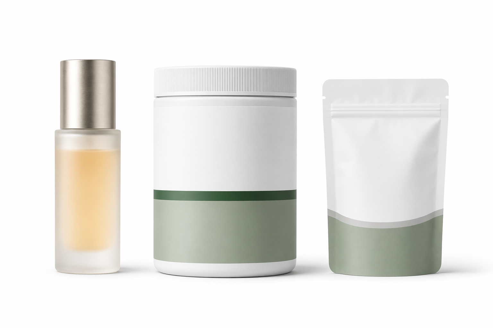

**Prompt (EN)**

```text
Goal: Create a clean marketplace bundle image that is immediately understandable at a glance.
Asset: Bundle packshot for e-commerce and marketplaces.
Scene: Pure white seamless background with subtle grounding shadows.
Subject: One hero product plus two clearly related accessories or refill units arranged in a tidy bundle layout.
Composition: Front-facing arrangement, all items fully visible, spacing clean, hierarchy obvious, no overlap that hides key shapes.
Lighting: Bright commercial studio light with crisp edges and soft natural shadow.
Materials and styling: Modern packaging, neutral retail-safe color palette, practical catalog look.
Constraints: No people, no props, no decoration, no logo, no readable text, no floating items, no clutter, no watermark.
```

**提示词（中文）**

```text
目标：生成一张一眼就能看懂的电商组合装产品图。
资产类型：用于电商平台和 marketplace 的 bundle packshot。
场景：纯白无缝背景，带轻微落影。
主体：一个主产品加两个明确相关的配件或补充装，整齐组合陈列。
构图：正面摆放，所有物品完整可见，间距干净，主次清楚，不要遮挡关键轮廓。
光线：明亮商业棚拍光，边缘清晰，阴影柔和自然。
材质与风格：现代包装，中性安全的零售色彩，偏目录图的实用风格。
约束：不要人物，不要道具，不要装饰，不要 logo，不要可读文字，不要悬浮摆放，不要杂乱，不要水印。
```

### 2. Luxury Skincare Hero

Use case: homepage hero, PDP top banner, premium paid social static  
Full file: [prompts/beauty/luxury-skincare-hero.md](./prompts/beauty/luxury-skincare-hero.md)

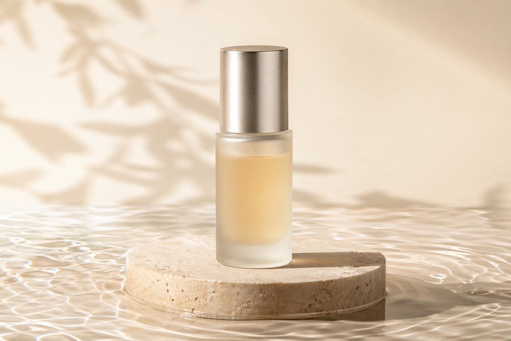

**Prompt (EN)**

```text
Goal: Create a premium skincare hero image that feels expensive, clean, and conversion-ready.
Asset: E-commerce hero banner for a facial serum launch.
Scene: Warm ivory studio set with a round travertine pedestal, shallow water ripples, and soft botanical shadows.
Subject: One frosted glass serum bottle with a brushed champagne cap and a blank label area.
Composition: Centered product, slightly low camera angle, full bottle clearly visible, generous negative space for headline overlay.
Lighting: Soft diffused studio light with luminous highlights and calm luxury mood.
Materials and styling: Frosted glass, brushed metal, polished stone, subtle water shimmer, restrained neutral palette.
Constraints: No logo, no readable text, no hands, no extra props, no duplicate products, no clutter, no deformation, no watermark.
```

**提示词（中文）**

```text
目标：生成一张高端护肤品主视觉，画面要昂贵、干净，并且适合电商转化。
资产类型：面部精华新品的电商 hero 横幅。
场景：温暖象牙色摄影棚场景，圆形洞石底座，浅浅水波反射，带有柔和植物投影。
主体：一只磨砂玻璃精华瓶，搭配香槟金拉丝瓶盖，标签区域保持空白。
构图：产品居中，略微低机位，整瓶完整可见，预留足够文案留白。
光线：柔和漫射棚拍光，带通透高光，整体情绪安静、洁净、奢华。
材质与风格：磨砂玻璃、拉丝金属、抛光石材、轻微水面反光，色调克制。
约束：不要 logo，不要可读文字，不要手，不要多余道具，不要重复产品，不要杂乱，不要变形，不要水印。
```

### 3. Streetwear On-Model Launch

Use case: collection drop hero, 4:5 paid social creative, homepage campaign tile  
Full file: [prompts/fashion/streetwear-on-model-launch.md](./prompts/fashion/streetwear-on-model-launch.md)

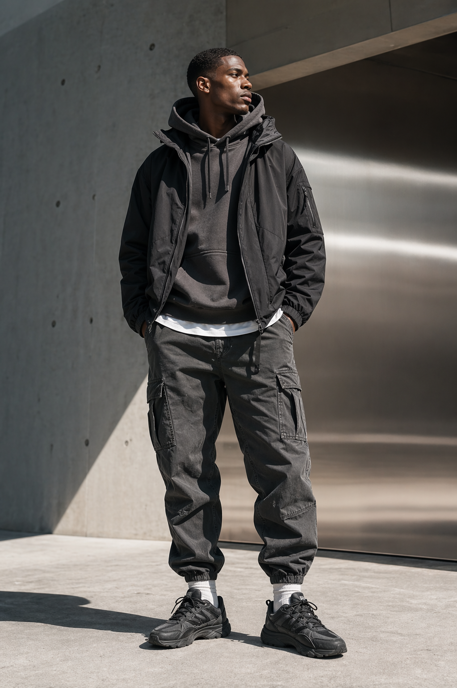

**Prompt (EN)**

```text
Goal: Create a premium on-model streetwear launch image that feels aspirational but still product-readable.
Asset: Campaign static for a new collection drop.
Scene: Clean urban architecture with concrete, brushed steel, and minimal background distraction.
Subject: One confident model wearing a complete streetwear outfit, clearly showing the jacket, pants, and footwear.
Composition: Mid-to-full-length framing, strong silhouette, relaxed campaign pose, negative space for copy.
Lighting: Natural daylight with polished editorial contrast, cool and sharp but believable.
Materials and styling: Cotton fleece, nylon, denim, technical fabric, muted charcoal and concrete tones with one accent color.
Constraints: No logo, no text, no crowd, no street clutter, no distorted hands, no distorted body proportions, no watermark.
```

**提示词（中文）**

```text
目标：生成一张高级街头服饰上身图，既有品牌调性，也能清楚展示产品。
资产类型：新品 drop 的 campaign 静态图。
场景：干净的城市建筑背景，包含混凝土和拉丝金属元素，但不喧宾夺主。
主体：一位自信模特，穿完整街头造型，外套、裤装和鞋款都要清楚可见。
构图：中长到全身构图，轮廓清晰，姿态自然，有文案留白。
光线：自然日光配合克制的编辑感对比，整体清爽、真实、有质感。
材质与风格：棉卫衣、尼龙、丹宁、机能面料，色彩以炭灰和水泥灰为主，辅以一个强调色。
约束：不要 logo，不要文字，不要人群，不要街景杂乱，不要手部畸形，不要身体比例错误，不要水印。
```

### 4. Footwear Floating Hero

Use case: sneaker PDP hero, paid social launch creative, collection landing banner  
Full file: [prompts/fashion/footwear-floating-hero.md](./prompts/fashion/footwear-floating-hero.md)

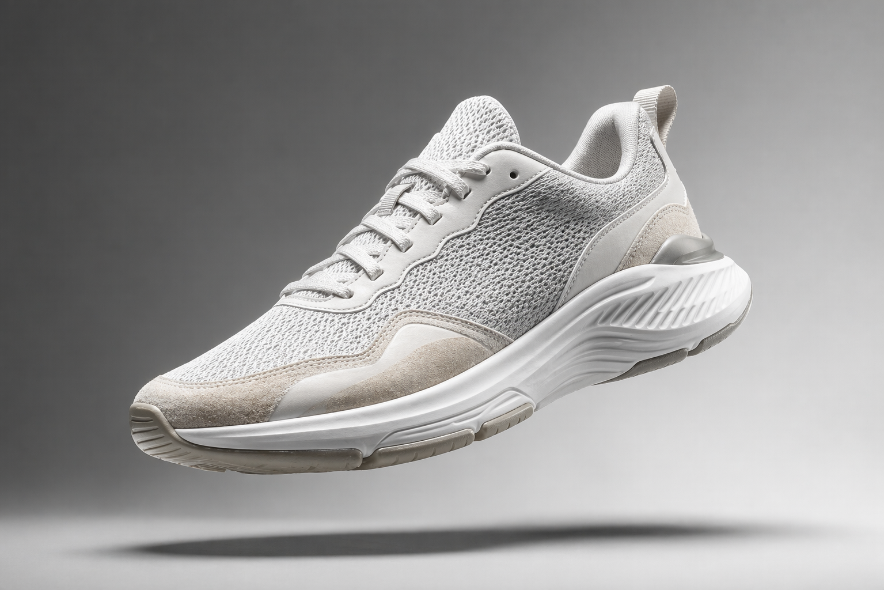

**Prompt (EN)**

```text
Goal: Create a premium footwear hero image that makes the product feel light, technical, and launch-ready.
Asset: Sneaker campaign visual for e-commerce.
Scene: Clean seamless gray studio gradient with subtle depth and restrained motion energy.
Subject: One modern sneaker floating in midair, showing upper material, side profile, and outsole shape clearly.
Composition: Three-quarter hero angle, product large in frame, strong negative space, crisp silhouette, no crop.
Lighting: Controlled studio lighting with sharp edge highlights and realistic grounding shadow.
Materials and styling: Mesh, suede, rubber outsole, subtle performance texture, premium sport-fashion finish.
Constraints: No logo, no readable text, no extra shoes, no feet, no laces flying wildly, no clutter, no watermark.
```

**提示词（中文）**

```text
目标：生成一张高级鞋履主视觉，让产品看起来轻盈、专业、适合新品发布。
资产类型：用于电商的运动鞋 campaign 视觉。
场景：干净的灰色无缝棚拍渐变背景，带轻微空间层次和克制的动态感。
主体：一只现代运动鞋悬浮在半空，鞋面材质、侧面轮廓和鞋底形态都要清楚。
构图：三分之四英雄角度，产品在画面中占比大，留白强，轮廓锐利，整只鞋不要被裁切。
光线：受控棚拍光，边缘高光明确，同时有真实落影。
材质与风格：网布、麂皮、橡胶大底、细腻性能纹理，兼具运动感和高端感。
约束：不要 logo，不要可读文字，不要第二只鞋，不要脚，不要夸张飞散鞋带，不要杂乱，不要水印。
```

### 5. Luxury Jewelry Campaign

Use case: jewelry launch campaign, homepage hero, premium social ad  
Full file: [prompts/jewelry/luxury-jewelry-campaign.md](./prompts/jewelry/luxury-jewelry-campaign.md)

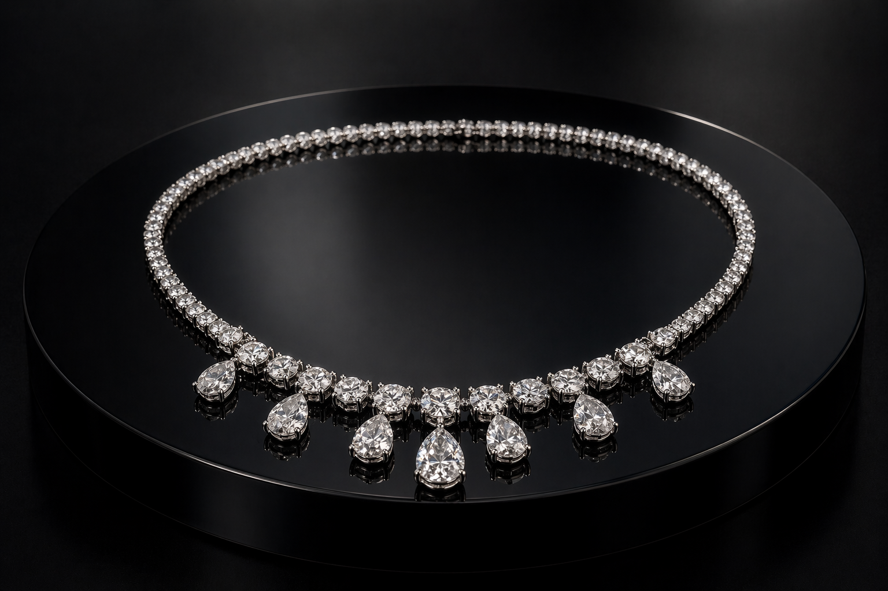

**Prompt (EN)**

```text
Goal: Create a luxury jewelry campaign image with clear craftsmanship and believable premium sparkle.
Asset: Homepage hero or social campaign for fine jewelry.
Scene: Deep charcoal-to-black luxury backdrop with a glossy black pedestal and restrained reflective surfaces.
Subject: One diamond necklace arranged elegantly as the hero piece.
Composition: Close-to-medium crop, full focal section of the necklace clearly visible, upscale magazine-ad balance, controlled negative space.
Lighting: Dramatic but controlled spotlighting with crisp gemstone highlights and soft shadow falloff.
Materials and styling: Polished precious metal, refined stone facets, black lacquer surface, intimate editorial mood.
Constraints: No model, no hands, no text, no logo, no exaggerated sparkle effects, no clutter, no cheap costume-jewelry look, no watermark.
```

**提示词（中文）**

```text
目标：生成一张高级珠宝 campaign 图，既要体现工艺，又要让珠宝闪耀真实可信。
资产类型：用于首页 hero 或社媒投放的高级珠宝主视觉。
场景：深炭黑到黑色的奢华背景，搭配高光黑色底座和克制的反射面。
主体：一条钻石项链作为唯一主角，摆放优雅。
构图：近景到中近景构图，项链核心部分必须清晰可见，整体像高级杂志广告。
光线：戏剧化但可控的聚光，钻石高光锐利，阴影柔和下沉。
材质与风格：抛光贵金属、精细切割宝石、黑色漆面反射、亲密而高端的编辑感。
约束：不要模特，不要手，不要文字，不要 logo，不要夸张星芒特效，不要杂乱，不要廉价饰品感，不要水印。
```

### 6. Kitchen Appliance Countertop Demo

Use case: PDP lifestyle secondary image, appliance launch creative, home-living ad static  
Full file: [prompts/home-living/kitchen-appliance-countertop-demo.md](./prompts/home-living/kitchen-appliance-countertop-demo.md)

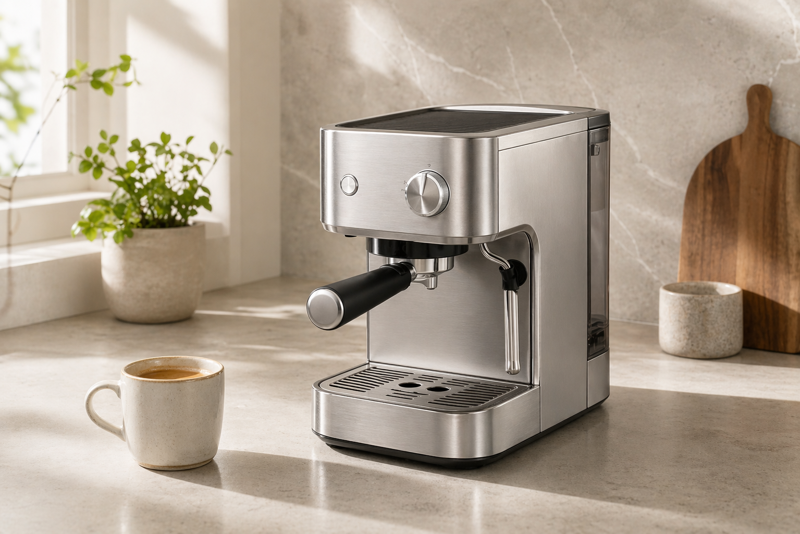

**Prompt (EN)**

```text
Goal: Create a premium lifestyle image for a countertop kitchen appliance that looks useful, modern, and giftable.
Asset: PDP secondary visual for a compact espresso machine.
Scene: Clean contemporary kitchen counter with stone backsplash, subtle morning light, and restrained supporting props.
Subject: One compact espresso machine as the hero product with a single cup nearby.
Composition: Three-quarter countertop view, appliance clearly dominant, enough surrounding context to feel lived-in but uncluttered.
Lighting: Soft natural morning light with crisp metallic highlights and believable shadow.
Materials and styling: Brushed metal, matte black details, ceramic cup, stone counter, minimal premium styling.
Constraints: No people, no text, no logo, no clutter, no extra appliances, no unrealistic steam, no watermark.
```

**提示词（中文）**

```text
目标：生成一张高端厨房小家电生活方式图，让产品显得实用、现代、适合送礼。
资产类型：紧凑型咖啡机的 PDP 辅助场景图。
场景：干净的现代厨房台面，石材挡板，柔和晨光，少量辅助道具。
主体：一台紧凑型咖啡机作为主产品，旁边只有一只咖啡杯。
构图：三分之四角度的台面视角，家电必须是绝对主角，环境提供生活感但不能杂乱。
光线：柔和自然晨光，金属高光清晰，阴影真实。
材质与风格：拉丝金属、哑光黑色细节、陶瓷杯、石材台面，整体极简高级。
约束：不要人物，不要文字，不要 logo，不要杂乱，不要额外家电，不要不真实的蒸汽，不要水印。
```

### 7. Fine Fragrance Obsidian Hero

Use case: fragrance launch campaign, luxury landing page hero, premium paid social static  
Full file: [prompts/fragrance/fine-fragrance-obsidian-hero.md](./prompts/fragrance/fine-fragrance-obsidian-hero.md)

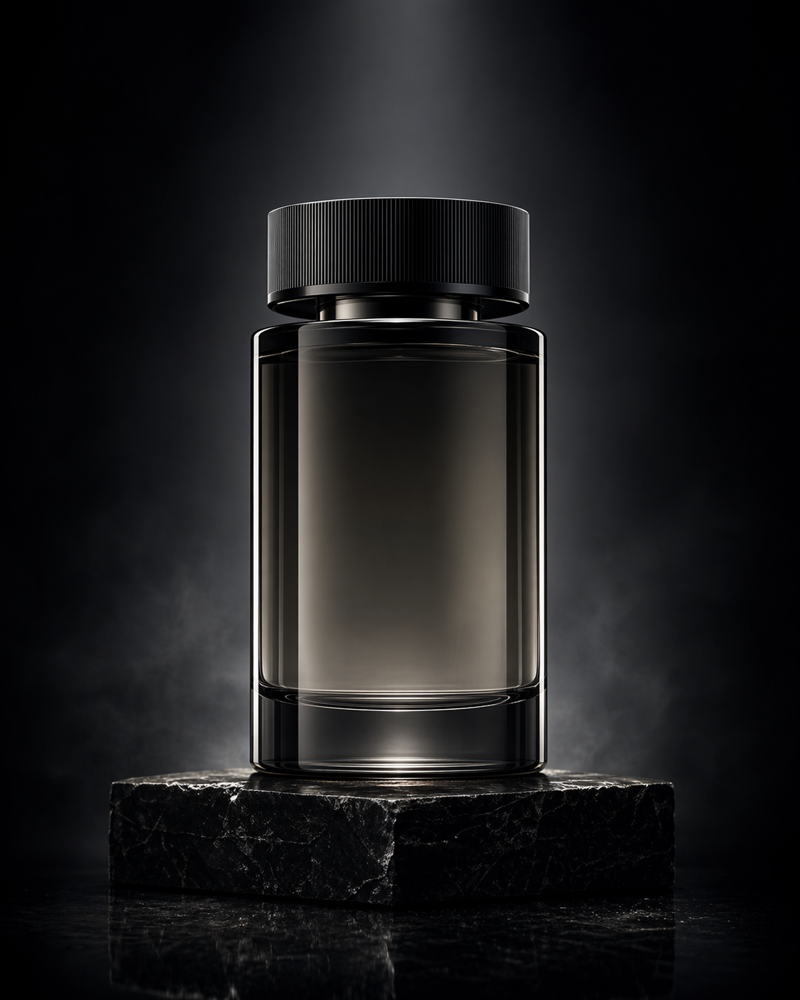

**Prompt (EN)**

```text
Goal: Create a cinematic fine-fragrance hero image that feels luxurious, mysterious, and brand-defining.
Asset: Commercial hero visual for a premium fragrance launch.
Scene: Deep black studio environment with an obsidian stone plinth, faint reflective surface, and restrained haze for atmosphere.
Subject: One architectural perfume bottle with smoked glass, a dark cap, and no visible branding.
Composition: Centered hero composition, bottle fully visible, strong symmetry, generous negative space, elegant luxury campaign balance.
Lighting: Controlled spotlight from above and behind with glossy edge highlights and soft reflected glow on the base.
Materials and styling: Smoked glass, polished lacquer, dark stone, minimal metallic accents, haute-luxury editorial mood.
Constraints: No text, no logo, no flowers, no model, no hands, no busy props, no cheap sparkle effects, no watermark.
```

**提示词（中文）**

```text
目标：生成一张电影感高级香氛主视觉，既神秘又昂贵，能承担品牌定调的作用。
资产类型：高端香水新品发布的商业 hero 视觉。
场景：深黑摄影棚环境，黑曜石底座，克制的反射面，配合极轻微氛围雾。
主体：一只建筑感香水瓶，烟熏玻璃瓶身，深色瓶盖，不出现品牌标识。
构图：居中主视觉，瓶身完整可见，整体偏对称，留白充分，像奢侈品 campaign。
光线：顶部和后方受控聚光，瓶身边缘高光干净，底座有柔和反射。
材质与风格：烟熏玻璃、抛光漆面、深色石材、少量金属细节，高级编辑感明显。
约束：不要文字，不要 logo，不要花卉，不要模特，不要手，不要繁杂道具，不要廉价闪光特效，不要水印。
```

### 8. Luxury Watch Macro Campaign

Use case: luxury watch launch, boutique homepage hero, collector social campaign  
Full file: [prompts/watches/luxury-watch-macro-campaign.md](./prompts/watches/luxury-watch-macro-campaign.md)

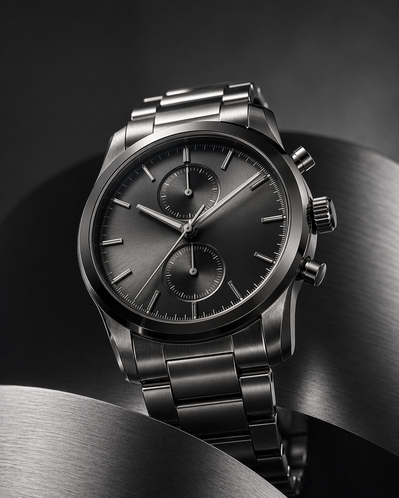

**Prompt (EN)**

```text
Goal: Create a luxury watch campaign image that emphasizes craftsmanship, metal finishing, and premium precision.
Asset: Commercial launch visual for a high-end wristwatch.
Scene: Dark graphite studio background with a curved brushed-metal pedestal and subtle shadow depth.
Subject: One premium wristwatch shown as the hero piece, with the case, bracelet, dial texture, and crown rendered clearly.
Composition: Tight hero crop, three-quarter angle, watch dominant in frame, composition balanced like a luxury print advertisement.
Lighting: Controlled directional lighting with crisp metal highlights, gentle contrast, and refined dial reflections.
Materials and styling: Brushed steel, polished bevels, sapphire crystal, precise dial texture, restrained monochrome luxury palette.
Constraints: No model, no wrist, no text, no logo, no extra watches, no loud color accents, no cheap CGI look, no watermark.
```

**提示词（中文）**

```text
目标：生成一张高级腕表 campaign 图，重点体现工艺、金属打磨和精密感。
资产类型：高端腕表发布的商业主视觉。
场景：深石墨色摄影棚背景，搭配弧形拉丝金属底座和克制的阴影层次。
主体：一只高端腕表作为主角，表壳、表链、表盘纹理和表冠都要清楚呈现。
构图：紧凑 hero 构图，三分之四角度，腕表在画面中占据主导，像奢侈腕表平面广告。
光线：方向性受控布光，金属高光利落，反差克制，表盘反射精致。
材质与风格：拉丝钢、抛光切面、蓝宝石镜面、精细表盘纹理，整体偏单色高奢调性。
约束：不要模特，不要手腕，不要文字，不要 logo，不要第二只表，不要跳脱色彩，不要廉价 CGI 感，不要水印。
```

### 9. Premium Headphones Sculptural Hero

Use case: consumer-tech launch art, premium audio homepage hero, paid social static  
Full file: [prompts/consumer-tech/premium-headphones-sculptural-hero.md](./prompts/consumer-tech/premium-headphones-sculptural-hero.md)

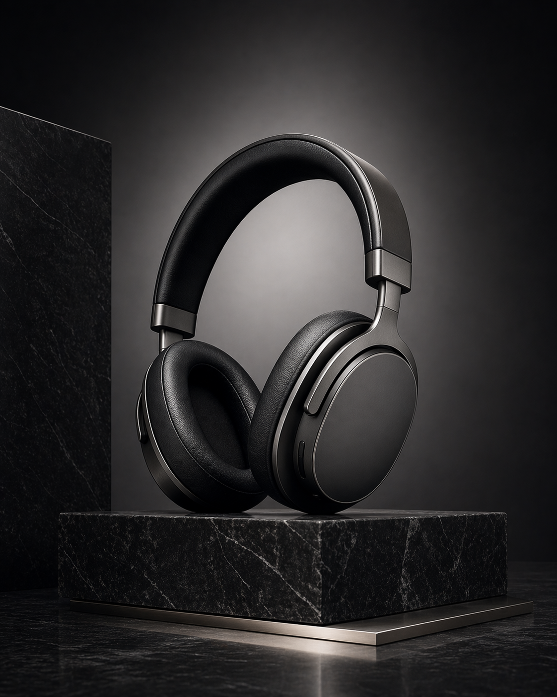

**Prompt (EN)**

```text
Goal: Create a premium consumer-tech hero image that feels sculptural, modern, and commercially polished.
Asset: Launch visual for flagship over-ear headphones.
Scene: Minimal stone-and-metal set with a soft gradient backdrop and a pedestal that feels like industrial sculpture.
Subject: One pair of over-ear headphones as the hero product, with the headband, earcups, and material finish clearly visible.
Composition: Three-quarter hero angle, product large in frame, elegant negative space, luxury-tech campaign balance.
Lighting: Soft but directional studio light with metallic edge highlights and premium shadow definition.
Materials and styling: Anodized metal, matte polymer, soft leather cushions, restrained graphite and silver palette.
Constraints: No logo, no text, no person, no floating cable clutter, no extra devices, no exaggerated neon effects, no watermark.
```

**提示词（中文）**

```text
目标：生成一张高级消费电子主视觉，让产品既像雕塑，又具备商业广告完成度。
资产类型：旗舰头戴式耳机发布视觉。
场景：极简石材与金属组合场景，柔和渐变背景，底座像工业雕塑。
主体：一副头戴式耳机作为唯一主角，头梁、耳罩和表面材质需要清楚可见。
构图：三分之四 hero 角度，产品占比大，留白优雅，整体像高端科技品牌 campaign。
光线：柔和但有方向性的棚拍光，边缘金属高光清晰，阴影有层次。
材质与风格：阳极氧化金属、哑光聚合物、柔软皮革耳垫，石墨灰与银色调克制高级。
约束：不要 logo，不要文字，不要人物，不要杂乱线缆，不要多余设备，不要夸张霓虹特效，不要水印。
```

### 10. Boutique Hotel Lobby Editorial

Use case: hospitality campaign, brand deck cover, boutique hotel homepage hero  
Full file: [prompts/hospitality/boutique-hotel-lobby-editorial.md](./prompts/hospitality/boutique-hotel-lobby-editorial.md)

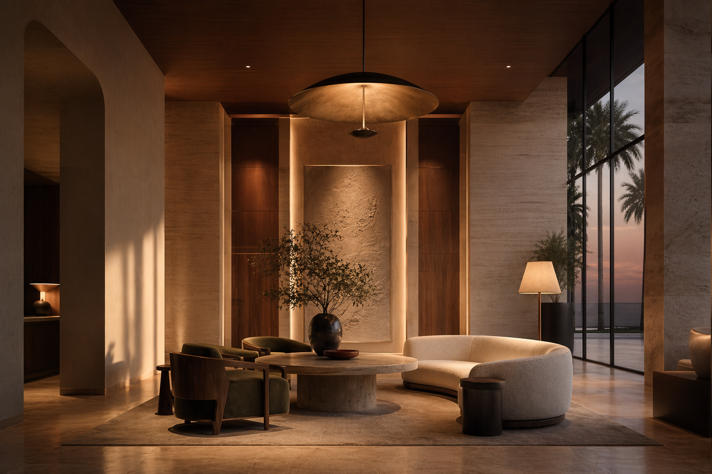

**Prompt (EN)**

```text
Goal: Create a boutique-hotel campaign image that feels intentional, warm, and editorial rather than generic real estate photography.
Asset: Hospitality brand hero image.
Scene: Sophisticated hotel lobby with curated furniture, sculptural lighting, stone flooring, and warm evening ambience.
Subject: The lobby itself as the hero environment, with one central seating vignette and a clear sense of premium hospitality.
Composition: Wide but intimate framing, layered depth, balanced symmetry, usable negative space for campaign copy.
Lighting: Warm architectural lighting mixed with soft natural dusk spill, cinematic but believable.
Materials and styling: Walnut wood, travertine, boucle upholstery, brushed brass, textured plaster walls, refined boutique styling.
Constraints: No readable signage, no visible brand marks, no crowd, no messy reception desk, no distortion, no watermark.
```

**提示词（中文）**

```text
目标：生成一张精品酒店品牌视觉图，气质要克制、温暖、有编辑感，而不是普通地产照片。
资产类型：酒店品牌首页 hero 或品牌提案封面图。
场景：精致的酒店大堂，带策展感家具、雕塑灯具、石材地面和温暖的傍晚氛围。
主体：大堂空间本身作为主角，中间有一个清晰的会客区场景，传达高端 hospitality 感。
构图：宽画幅但有亲密感，空间层次清楚，构图平衡，预留文案留白。
光线：建筑暖光与傍晚自然光混合，电影感但可信。
材质与风格：胡桃木、洞石、羊羔绒面料、拉丝黄铜、肌理灰泥墙面，整体像精品酒店品牌 campaign。
约束：不要可读标识，不要品牌 logo，不要拥挤人群，不要凌乱前台，不要透视畸变，不要水印。
```

## Luxury Brand Language Series

These four additions are designed to feel closer to top-tier luxury maison advertising systems: more restraint, stronger art direction, and more believable premium materials.

### 11. Haute Jewelry Maison Salon

Use case: maison-style high jewelry launch, editorial hero, premium collection campaign  
Full file: [prompts/jewelry/haute-jewelry-maison-salon.md](./prompts/jewelry/haute-jewelry-maison-salon.md)

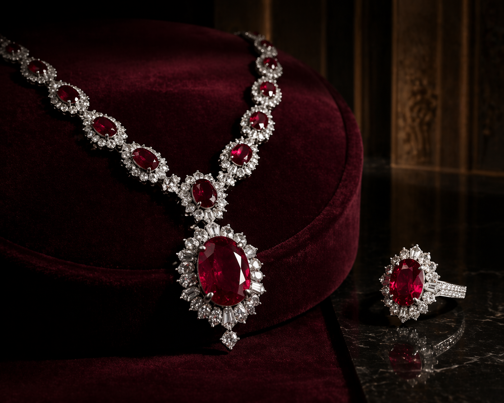

**Prompt (EN)**

```text
Goal: Create a top-tier high-jewelry campaign visual with the quiet authority of a historic luxury maison, emphasizing craftsmanship, rarity, and controlled brilliance.
Asset: Brand hero image for a high jewelry collection reveal.
Scene: Intimate salon-like luxury set with deep burgundy velvet, lacquered dark stone, and a faint architectural backdrop that feels refined rather than theatrical.
Subject: One exceptional gemstone necklace paired with a matching ring, arranged as a curated set with the necklace clearly leading.
Composition: Editorial luxury campaign composition, close-to-medium crop, elegant asymmetry, deliberate negative space, every key jewelry surface visible and believable.
Lighting: Focused museum-grade spotlighting with crisp gemstone fire, soft ambient falloff, and subtle reflections that feel expensive and real.
Materials and styling: Diamond and ruby-like stones, polished precious metal, velvet, lacquer, deep maison palette, restrained opulence.
Constraints: No model, no hands, no text, no logo, no obvious brand imitation, no exaggerated sparkle stars, no clutter, no cheap costume-jewelry feel, no watermark.
```

**提示词（中文）**

```text
目标：生成一张具备顶级珠宝 maison 广告语言的高珠 campaign 图，重点体现稀缺感、工艺感和克制的高级闪耀。
资产类型：高级珠宝系列发布的品牌 hero 主视觉。
场景：带有私享沙龙气质的奢华布景，深酒红天鹅绒、深色漆面石材，以及若隐若现的建筑背景，精致但不浮夸。
主体：一条高珠宝石项链搭配一枚配套戒指组成系列，其中项链必须是绝对主角。
构图：高级编辑式构图，近景到中近景，优雅的不对称布局，留白克制，关键珠宝面都要真实可见。
光线：博物馆级聚光，宝石火彩清晰但不过度，环境光柔和下沉，反射克制而昂贵。
材质与风格：钻石与红宝石质感、抛光贵金属、天鹅绒、漆面石材，整体是深色 maison 调性下的克制奢华。
约束：不要模特，不要手，不要文字，不要 logo，不要明显模仿任何具体品牌，不要夸张星芒，不要杂乱，不要廉价饰品感，不要水印。
```

### 12. Heritage Leather Goods Maison Hero

Use case: luxury leather goods campaign, homepage hero, brand editorial launch  
Full file: [prompts/fashion/heritage-leather-goods-maison-hero.md](./prompts/fashion/heritage-leather-goods-maison-hero.md)

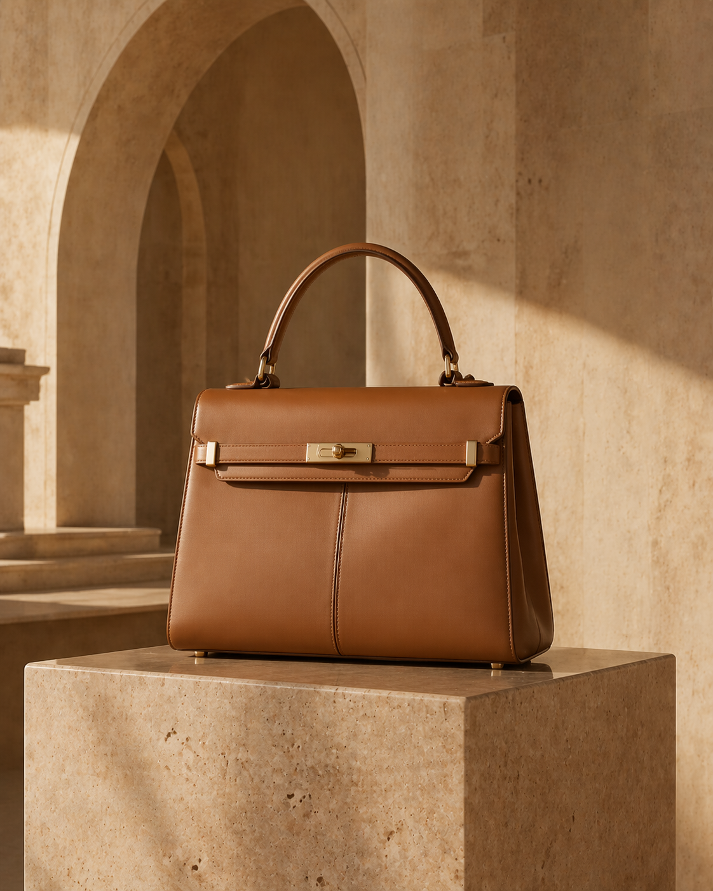

**Prompt (EN)**

```text
Goal: Create a heritage-luxury leather goods campaign visual that feels timeless, architectural, and globally premium.
Asset: Homepage hero for a leather goods collection launch.
Scene: Warm stone interior with sculptural arches, rich shadow depth, and a polished plinth that suggests a flagship boutique without showing a store.
Subject: One structured top-handle leather bag as the hero piece, with refined hardware and a sculptural silhouette.
Composition: Center-weighted but editorial, bag fully visible, room for premium negative space, luxury print-ad balance, no crop.
Lighting: Soft directional sunlight crossing the set from one side, producing elegant contrast, gentle specular highlights on hardware, and believable grounding shadow.
Materials and styling: Smooth calfskin leather, brushed gold-tone hardware, travertine or limestone surfaces, warm neutral palette, understated European luxury mood.
Constraints: No model, no hands, no scarf, no logo, no monogram, no text, no shopping props, no clutter, no watermark.
```

**提示词（中文）**

```text
目标：生成一张具备 heritage luxury 气质的皮具广告主视觉，让画面显得 timeless、建筑化且国际化高级。
资产类型：皮具系列发布的首页 hero 主视觉。
场景：温暖石材室内空间，带雕塑感拱门和层次丰富的阴影，底座像精品旗舰店陈列但不直接出现门店。
主体：一只硬挺结构感手提包作为唯一主角，五金精致，轮廓具有雕塑感。
构图：偏居中但保持编辑感，包身完整可见，留白高级，像奢侈品牌平面广告，不要裁切主体。
光线：单侧柔和方向性日光穿过空间，形成优雅对比，五金高光克制，落影真实。
材质与风格：光滑小牛皮、拉丝金色金属件、洞石或石灰石表面、温暖中性色调，整体是低调欧洲高奢氛围。
约束：不要模特，不要手，不要丝巾，不要 logo，不要老花，不要文字，不要购物道具，不要杂乱，不要水印。
```

### 13. Horology Maison Midnight Atelier

Use case: luxury watch maison campaign, boutique hero, collector launch visual  
Full file: [prompts/watches/horology-maison-midnight-atelier.md](./prompts/watches/horology-maison-midnight-atelier.md)

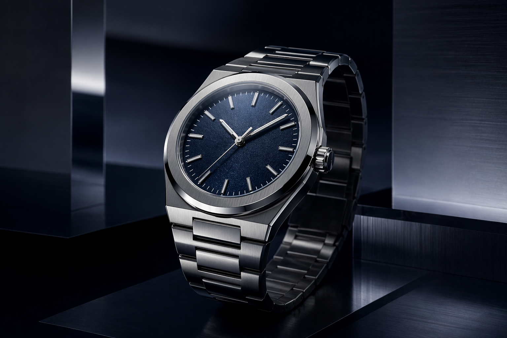

**Prompt (EN)**

```text
Goal: Create a high-horology campaign image with the emotional restraint and technical prestige of a flagship maison, highlighting craft and precision rather than loud flash.
Asset: Commercial hero image for a collector-grade watch launch.
Scene: Midnight-blue to near-black atelier environment with layered metallic planes, faint reflections, and a subtle sense of engineered architecture.
Subject: One precious-metal wristwatch as the hero object, with dial texture, bezel finishing, bracelet articulation, and crystal reflections all clearly resolved.
Composition: Tight but luxurious three-quarter composition, watch dominant in frame, strong negative space, refined asymmetry, suitable for a flagship boutique homepage.
Lighting: Controlled low-key lighting with razor-clean edge highlights, selective dial illumination, and soft graduated shadow.
Materials and styling: Brushed and polished precious metal, sapphire crystal, deep blue-black surfaces, minimal haute horlogerie palette, restrained campaign mood.
Constraints: No wrist, no model, no text, no logo, no second watch, no loud accent colors, no exaggerated reflections, no cheap CGI feel, no watermark.
```

**提示词（中文）**

```text
目标：生成一张具备顶级制表 maison 气质的腕表 campaign 图，用克制的情绪和技术权威感体现工艺与精准，而不是浮夸炫耀。
资产类型：收藏级腕表发布的商业 hero 主视觉。
场景：午夜蓝到近黑的 atelier 空间，带层叠金属平面、轻微反射和工程建筑般的秩序感。
主体：一只贵金属腕表作为主角，表盘纹理、表圈打磨、表链结构和镜面反射都要清晰可信。
构图：紧凑但奢华的三分之四构图，腕表占主导，留白强，不对称但平衡，适合旗舰精品店首页。
光线：低调受控布光，边缘高光像刀锋一样干净，表盘局部照明精确，阴影层层渐隐。
材质与风格：拉丝与抛光贵金属、蓝宝石镜面、深蓝黑表面，整体是高级制表的克制高奢调性。
约束：不要手腕，不要模特，不要文字，不要 logo，不要第二只表，不要高饱和强调色，不要夸张反射，不要廉价 CGI 感，不要水印。
```

### 14. Haute Parfum Nocturne Series

Use case: luxury fragrance campaign, brand launch hero, premium paid social static  
Full file: [prompts/fragrance/haute-parfum-nocturne-series.md](./prompts/fragrance/haute-parfum-nocturne-series.md)

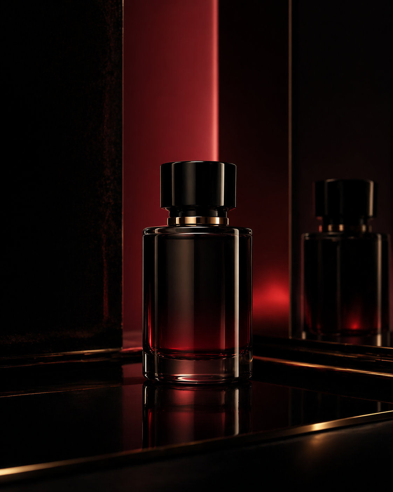

**Prompt (EN)**

```text
Goal: Create a haute-parfum campaign image with strong identity, sensual restraint, and a premium nighttime editorial mood.
Asset: Brand hero visual for a fragrance collection launch.
Scene: Nocturnal luxury set with black lacquer, dark mirror reflections, and a ribbon of deep garnet light cutting through the darkness.
Subject: One sculptural perfume bottle in dark glass with a refined cap, staged as a collectible object with no visible branding.
Composition: Centered-to-slightly-off-center hero composition, bottle fully visible, elegant vertical emphasis, generous negative space, cinematic luxury balance.
Lighting: Low-key spotlighting with jewel-like reflections, soft glow behind the bottle, and precise highlights that define the silhouette.
Materials and styling: Smoked glass, polished lacquer, black mirror, garnet-toned atmosphere, sensual editorial finish.
Constraints: No flowers, no model, no hands, no text, no logo, no liquid splashes, no busy props, no cheap nightclub vibe, no watermark.
```

**提示词（中文）**

```text
目标：生成一张顶级香氛广告图，既有强识别度，又有克制的感官张力和夜色编辑感。
资产类型：香水系列发布的品牌 hero 主视觉。
场景：夜色高奢布景，黑色漆面、深色镜面反射，以及一道深石榴红光线穿过黑暗。
主体：一只深色玻璃雕塑感香水瓶作为唯一主角，瓶盖精致，不出现品牌标识。
构图：居中或轻微偏心的主视觉构图，瓶身完整可见，竖向气质明确，留白充分，整体像电影感奢侈品广告。
光线：低调聚光，反射像宝石一样精确，瓶后有轻柔背光，轮廓高光清楚定义形体。
材质与风格：烟熏玻璃、抛光漆面、黑镜反射、石榴红氛围光，整体带感官化高级编辑质感。
约束：不要花，不要模特，不要手，不要文字，不要 logo，不要液体飞溅，不要繁杂道具，不要廉价夜店感，不要水印。
```

## Commercial Format Expansion

Research notes: [docs/commercial-image-types.md](./docs/commercial-image-types.md)

These additions are for commercial formats that are common in real launches, but are usually missing from prompt repositories: OOH, editorial collage systems, unboxing, mobile story frames, scale explainers, and collection grids.

### 15. OOH Billboard Brand Takeover

Use case: outdoor billboard mockup, launch key visual, retail window campaign concept  
Full file: [prompts/commercial-formats/ooh-billboard-brand-takeover.md](./prompts/commercial-formats/ooh-billboard-brand-takeover.md)

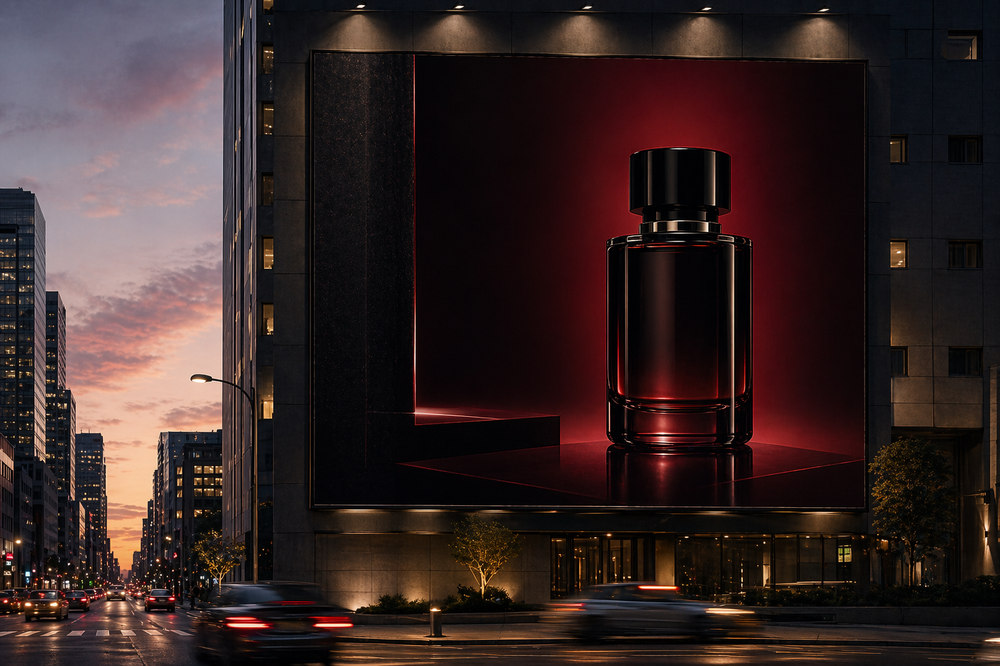

**Prompt (EN)**

```text
Goal: Create a commercial out-of-home campaign visual that feels bold, premium, and scalable beyond a product page.
Asset: Billboard or large-format brand takeover visual for a premium launch.
Scene: A real urban streetscape or transit environment featuring one dominant billboard or wall placement, with the ad itself as the visual hero.
Subject: One signature product or brand object enlarged into a graphic-led campaign visual with a strong silhouette and room for headline placement.
Composition: Wide composition, billboard clearly readable from a distance, ad area dominant, surrounding environment supportive but not distracting.
Lighting: Natural city light or cinematic dusk light depending on the setting, with believable environmental reflections and shadows.
Materials and styling: Premium campaign art direction, bold negative space, clean graphic hierarchy, retail-ready polish.
Constraints: No existing brand logos, no readable trademarked ads in the surroundings, no cluttered street chaos, no watermark.
```

**提示词（中文）**

```text
目标：生成一张适合户外广告或大幅品牌投放的商业视觉，而不是普通产品页图片。
资产类型：高端新品发布的 billboard / 大型品牌占位主视觉。
场景：真实城市街道、地铁或商业空间里出现一个主导性的广告位，广告画面本身必须是视觉主角。
主体：一个标志性产品或品牌物件被放大处理成图形化 campaign 视觉，轮廓强烈，并为标题留出空间。
构图：宽画幅，广告位远看也足够明确，广告区域占主导，周边环境只做衬托不过度抢戏。
光线：根据场景使用自然城市光或电影感傍晚光，环境反射和阴影要可信。
材质与风格：高级 campaign art direction，大块留白，清晰图形层级，具备零售传播完成度。
约束：不要出现现成品牌 logo，不要出现可读的第三方广告，不要杂乱街景，不要水印。
```

### 16. Editorial Collage Campaign Board

Use case: campaign moodboard, collection launch board, brand deck cover visual  
Full file: [prompts/commercial-formats/editorial-collage-campaign-board.md](./prompts/commercial-formats/editorial-collage-campaign-board.md)

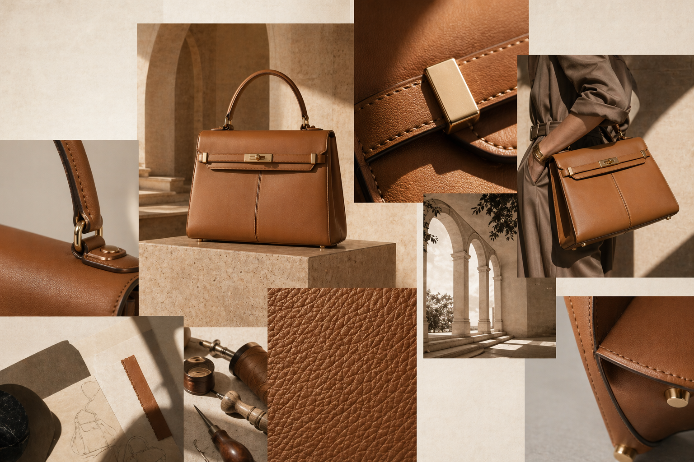

**Prompt (EN)**

```text
Goal: Create an editorial commercial collage that feels like a real campaign board, not a single product shot.
Asset: Mood-setting launch visual for a premium brand presentation or campaign reveal.
Scene: A layered collage system combining cropped product imagery, material textures, atmospheric scene fragments, and clean graphic pacing.
Subject: One hero product family supported by close-up detail crops, contextual lifestyle fragments, and abstract material references.
Composition: Asymmetrical multi-panel layout with intentional overlap, varied crop scale, editorial whitespace, and strong visual rhythm.
Lighting: Consistent premium photographic lighting across all image fragments, even if the collage includes multiple panels.
Materials and styling: Magazine-editorial design language, tactile textures, matte paper feel, controlled luxury palette, high-end campaign board finish.
Constraints: No chaotic scrapbook look, no childish stickers, no obvious brand imitation, no watermark.
```

**提示词（中文）**

```text
目标：生成一张真正像品牌 campaign board 的编辑拼贴图，而不是单张商品展示图。
资产类型：高端品牌提案、系列发布或创意定调用的 moodboard 主视觉。
场景：由裁切产品图、材质纹理、氛围场景碎片和克制图形节奏组成的多层拼贴系统。
主体：一个核心产品家族作为主线，搭配局部细节、生活方式碎片和抽象材质参考。
构图：不对称多模块布局，允许适度重叠，裁切尺度有变化，留白有编辑感，整体节奏强。
光线：即使是多张碎片画面，也要保持统一的高级摄影光感。
材质与风格：杂志级编辑设计语言、可触感纹理、哑光纸面气质、克制高端配色，像真实 campaign 提案板。
约束：不要混乱手账风，不要幼稚贴纸，不要明显模仿具体品牌，不要水印。
```

### 17. Packaging Unboxing Reveal

Use case: gifting campaign, creator-style launch asset, premium packaging reveal  
Full file: [prompts/commercial-formats/packaging-unboxing-reveal.md](./prompts/commercial-formats/packaging-unboxing-reveal.md)

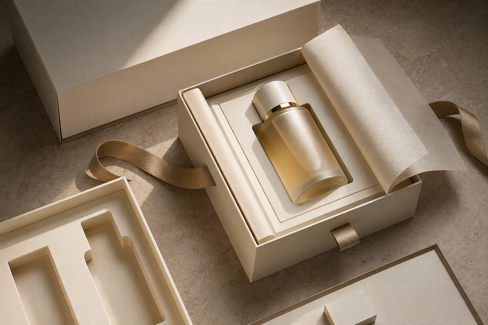

**Prompt (EN)**

```text
Goal: Create a premium packaging reveal image that captures the ritual and anticipation of opening a product.
Asset: Social campaign or launch visual focused on unboxing.
Scene: Refined tabletop or soft luxury interior with the product box partially opened, layered packaging components visible, and a curated sense of sequence.
Subject: One premium product with its packaging, inserts, wrapping, or tray system presented as a reveal rather than a flat product display.
Composition: Three-quarter or top-down angle, enough depth to show packaging architecture, product reveal, and premium details in one frame.
Lighting: Soft directional light with tactile highlights on paper, ribbon, lacquer, or metal details.
Materials and styling: Structured packaging, tissue or sleeve details, refined paper textures, gift-worthy finish, modern premium color palette.
Constraints: No hands, no readable logo, no messy tearing, no cheap subscription-box feel, no clutter, no watermark.
```

**提示词（中文）**

```text
目标：生成一张强调开箱仪式感和期待感的包装 reveal 图，而不是普通商品摆拍。
资产类型：新品发布或社媒传播用的 unboxing 主视觉。
场景：精致桌面或柔和高端室内环境，产品盒半打开，包装层级、内托和配件关系清楚可见。
主体：一个高端产品连同包装、内衬、包裹结构一起呈现，重点是“揭示过程”而不是平铺展示。
构图：三分之四角度或俯拍角度，既能看到包装结构，也能看到产品本体和高级细节。
光线：柔和方向性布光，让纸张、缎带、漆面或金属边缘都具备触感。
材质与风格：结构化包装、薄纸或套封细节、精致纸面纹理、礼赠感完成度、现代高级配色。
约束：不要手，不要可读 logo，不要凌乱撕扯感，不要廉价订阅盒风格，不要杂乱，不要水印。
```

## More Bilingual Cases

- Beauty: [Clinical Beauty Dropper Detail](./prompts/beauty/clinical-beauty-dropper-detail.md)
- Commercial Formats: [Scale Comparison Explainer](./prompts/commercial-formats/scale-comparison-explainer.md), [Social Story Launch Frame](./prompts/commercial-formats/social-story-launch-frame.md), [Lookbook Collection Grid](./prompts/commercial-formats/lookbook-collection-grid.md), [Conversion Promo Banner](./prompts/commercial-formats/conversion-promo-banner.md), [Trust Proof Case Study Visual](./prompts/commercial-formats/trust-proof-case-study-visual.md), [Knowledge Infographic Editorial](./prompts/commercial-formats/knowledge-infographic-editorial.md)
- Fashion: [Editorial Fashion Flatlay](./prompts/fashion/editorial-fashion-flatlay.md), [Luxury Handbag Shelf Hero](./prompts/fashion/luxury-handbag-shelf-hero.md), [Heritage Leather Goods Maison Hero](./prompts/fashion/heritage-leather-goods-maison-hero.md)
- Food & Beverage: [Clean Supplement Packshot](./prompts/food-beverage/clean-supplement-packshot.md), [Organic Coffee Lifestyle Pour](./prompts/food-beverage/organic-coffee-lifestyle-pour.md)
- Home & Living: [Minimal Bedding Hero](./prompts/home-living/minimal-bedding-hero.md), [Scandinavian Chair Lifestyle](./prompts/home-living/scandinavian-chair-lifestyle.md)
- Jewelry: [Bridal Ring Macro Detail](./prompts/jewelry/bridal-ring-macro-detail.md), [Haute Jewelry Maison Salon](./prompts/jewelry/haute-jewelry-maison-salon.md)
- Watches: [Luxury Watch Macro Campaign](./prompts/watches/luxury-watch-macro-campaign.md), [Horology Maison Midnight Atelier](./prompts/watches/horology-maison-midnight-atelier.md)
- Fragrance: [Fine Fragrance Obsidian Hero](./prompts/fragrance/fine-fragrance-obsidian-hero.md), [Haute Parfum Nocturne Series](./prompts/fragrance/haute-parfum-nocturne-series.md)
- Consumer Tech: [Premium Headphones Sculptural Hero](./prompts/consumer-tech/premium-headphones-sculptural-hero.md), [Flagship Smartphone Cinematic Launch](./prompts/consumer-tech/flagship-smartphone-cinematic-launch.md)
- Automotive: [Luxury EV Night Showroom](./prompts/automotive/luxury-ev-night-showroom.md)
- Hospitality: [Boutique Hotel Lobby Editorial](./prompts/hospitality/boutique-hotel-lobby-editorial.md), [Chef Tasting Menu Plating Campaign](./prompts/hospitality/chef-tasting-menu-plating-campaign.md)
- Spirits: [Premium Whisky Decanter Hero](./prompts/spirits/premium-whisky-decanter-hero.md)
- Seasonal: [Summer Beverage Launch Banner](./prompts/seasonal-campaigns/summer-beverage-launch-banner.md), [Holiday Gift Box Hero](./prompts/seasonal-campaigns/holiday-gift-box-hero.md)

## Repository Structure

```text
assets/examples/          Generated sample images
docs/                    Prompting best-practice notes
data/prompts.json        Prompt metadata
prompts/                 Bilingual prompt files
```

## Contribution Standard

We prefer prompts that are:

- useful for real commercial workflows
- specific enough to reproduce consistently
- written in both English and Chinese
- explicit about constraints
- strong visually without drifting into generic "AI art"
- usable for either conversion assets or brand-building campaigns

Please read [CONTRIBUTING.md](./CONTRIBUTING.md) before opening a PR.
